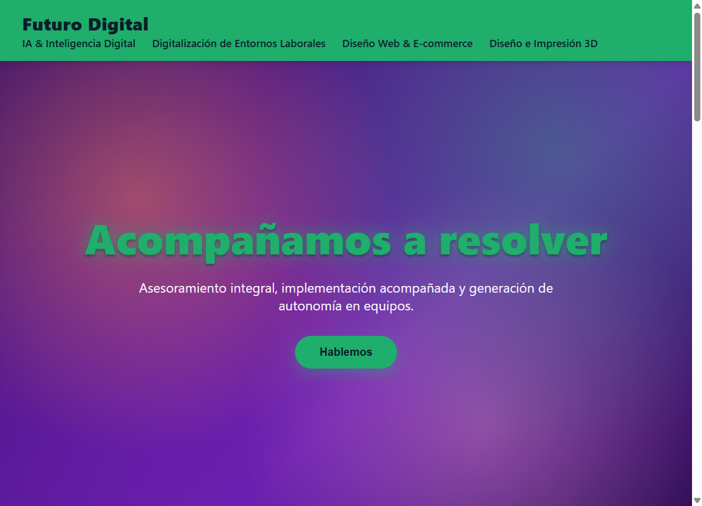
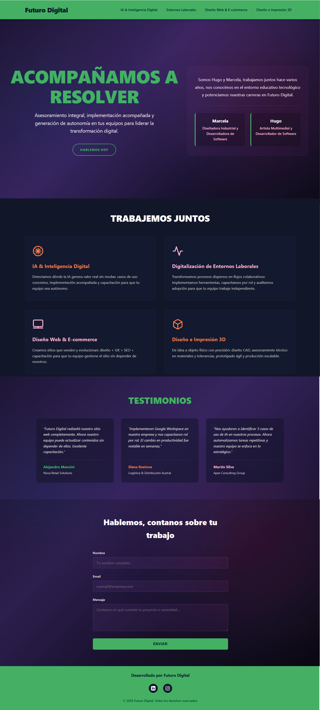

Futuro Digital - PFO2 Prompt Engineering en Agentes de IA
👤 Datos del Estudiante

Nombre y Apellido: Rocío Jiménez Espada H. (Roji)

Institución: Instituto de Formación Técnica Superior (IFTS) N.° 29

Asignatura: Desarrollo de Sistemas Web (Front End)

Comisión: Lunes

Fecha de Entrega: 26 de Junio de 2026

🚀 Deploy Unificado
URL Vercel: https://pfo-2-futuro-digital.vercel.app
El proyecto se encuentra completamente deployado en una única URL que funciona como portada con acceso a:
El prompt exacto utilizado

Landing Page generada por Claude Code https://pfo-2-futuro-digital.vercel.app/claude-code/index.html 

Capturas de Pantalla

Landing Page generada por Gemini Pro https://pfo-2-futuro-digital.vercel.app/gemini/index.html

Capturas de Pantalla 

📝 Prompt Exacto Utilizado
El siguiente prompt fue ejecutado sin cambios en dos agentes de IA distintos:
# ROL Y CONTEXTO

Eres un Ingeniero Frontend Senior especializado en diseño moderno, 
responsivo y creativo. Tu tarea es generar una Landing Page completa 
para "Futuro Digital", empresa de asesoramiento, desarrollo e 
implementación en transformación digital.

## EQUIPO Y PROPUESTA
- Fundadores: Hugo (Artista Multimedial + Dev Software) y Marcela 
  (Diseñadora Industrial + Dev Software)
- Propuesta: "Acompañamos a resolver" - asesoramiento integral, 
  implementación acompañada y generación de autonomía en equipos.

---

# REQUISITOS VISUALES Y DE DISEÑO

## Paleta de Colores
- Violeta (predominante, fondo con gradientes)
- Verde (cabecera y hero, contraste principal)
- Azul profundo (sección servicios)
- Naranja y Rosa claro (texto servicios)
- Blanco/Gris (textos base)

## Fondo Principal
Gradiente abstracto tipo "nube" con colores fluor dispersos, 
predominio de violeta. Sensación dinámica y moderna.

---

# ESTRUCTURA OBLIGATORIA (7 SECCIONES)

## 1. CABECERA (Header)
- Logo/Texto: "Futuro Digital" (centro o izquierda)
- Menú de navegación sticky con opciones:
  • IA & Inteligencia Digital
  • Digitalización de Entornos Laborales
  • Diseño Web & E-commerce
  • Diseño e Impresión 3D
- Color fondo: Verde sólido pleno
- Contraste: Alto, legible

## 2. HERO SECTION
- Texto grande: "Acompañamos a resolver"
- Color texto: Verde con buen contraste vs fondo violeta
- Fondo: Gradiente violeta con colores fluor dispersos (efecto nube)
- Impacto visual: Debe ser la sección más llamativa
- Opcional: CTA (botón) subtle

## 3. SOBRE NOSOTROS / DESCRIPCIÓN
Bloque de texto que diga:
"Somos Hugo y Marcela, trabajamos juntos hace varios años, 
nos conocimos en el entorno educativo tecnológico y potenciamos 
nuestras carreras en Futuro Digital.

Marcela: Diseñadora Industrial y Desarrolladora de Software
Hugo: Artista Multimedial y Desarrollador de Software"

Estética limpia, tipografía legible.

## 4. SERVICIOS (Bloque "Trabajemos Juntos")
- Título: "Trabajemos juntos"
- Fondo: Azul profundo pleno
- Grid de 4 tarjetas (2x2 en desktop, 1 en mobile)
- CADA tarjeta debe incluir:
  • Título del servicio
  • Descripción (la de 1 renglón que propusimos)
  • Dibujo/Icono lineal minimalist que acompañe
- Colores texto: Jugar entre naranja y rosa claro
- Servicios:

  1. IA & Inteligencia Digital
     "Detectamos dónde la IA genera valor real sin modas: casos de 
      uso concretos, implementación acompañada y capacitación para 
      que tu equipo sea autónomo."

  2. Digitalización de Entornos Laborales
     "Transformamos procesos dispersos en flujos colaborativos: 
      implementamos herramientas, capacitamos por rol y auditamos 
      adopción para que tu equipo trabaje independiente."

  3. Diseño Web & E-commerce
     "Creamos sitios que venden y evolucionan: diseño + UX + SEO + 
      capacitación para que tu equipo gestione el sitio sin depender 
      de nosotros."

  4. Diseño e Impresión 3D
     "De idea a objeto físico con precisión: diseño CAD, asesoramiento 
      técnico en materiales y tolerancias, prototipado ágil y 
      producción escalable."

## 5. TESTIMONIOS
- 3 bloques de testimonio (tarjetas)
- Cada bloque: Nombre | Empresa | Texto del testimonio
- Respeta paleta (violeta, verde, naranja, rosa)

  Testimonio 1 (Diseño Web):
  "Futuro Digital rediseñó nuestro sitio web completamente. Ahora 
   nuestro equipo puede actualizar contenidos sin depender de ellos. 
   Excelente capacitación."
  - Nombre: [Generar nombre profesional]
  - Empresa: [Generar nombre empresa tipo servicios/retail]

  Testimonio 2 (Digitalización):
  "Implementaron Google Workspace en nuestra empresa y nos capacitaron 
   rol por rol. El cambio en productividad fue notable en semanas."
  - Nombre: [Generar nombre profesional]
  - Empresa: [Generar nombre empresa tipo PYME/corporativa]

  Testimonio 3 (IA):
  "Nos ayudaron a identificar 3 casos de uso de IA en nuestros procesos. 
   Ahora automatizamos tareas repetitivas y nuestro equipo se enfoca en 
   lo estratégico."
  - Nombre: [Generar nombre profesional]
  - Empresa: [Generar nombre empresa tipo tech/consultoría]

## 6. FORMULARIO DE CONTACTO
- Encabezado: "Hablemos, contanos sobre tu trabajo"
- Campos:
  • Nombre (text input)
  • Email (email input)
  • Mensaje (textarea)
  • Botón "Enviar" (visual, no requiere funcionalidad backend)
- Estética: Limpia, coherente con paleta
- Validación HTML5 nativa (visual)

## 7. FOOTER
- Color fondo: Verde (igual a cabecera)
- Contenido lateral: "Desarrollado por Futuro Digital"
- Iconos redes sociales:
  • LinkedIn (violeta)
  • Instagram (violeta)
- Enlaces funcionales o placeholders claros
- Copyright opcional

---

# REQUISITOS TÉCNICOS

## Stack
- HTML5 semántico
- CSS3 moderno (Flexbox/Grid)
- JavaScript vanilla (solo si necesario para interactividad)
- Sin dependencias externas complejas

## Responsividad
- Mobile-first approach
- Breakpoints: 320px, 768px, 1024px
- Debe verse perfecto en celular y desktop

## Restricción Crítica
NO EDITAR CÓDIGO MANUALMENTE. El agente debe generar 100% del código 
funcionable y listo para deploy. No omitir secciones ni dejar placeholders.

---

# FORMATO DE SALIDA

Entrega un ÚNICO archivo index.html completo y funcional que incluya:
1. Todo el HTML5 estructurado
2. Todo el CSS3 incrustado (en <style> tag)
3. Todos los iconos/dibujos como SVG inline o símbolos CSS
4. Código comentado en español
5. Listo para copiar-pegar y abrir en navegador

NO separes en múltiples archivos.

📊 Comparativa de Resultados
Observaciones Clave
Claude Code:
✅ Estructura muy limpia y modular
✅ Paleta de colores respetada fielmente
✅ Animaciones y transiciones suaves
✅ Code comments en español completos
✅ Responsive design perfecto
Gemini:
✅ Interpretación más libre del diseño
✅ Layout alternativo (hero a dos columnas)
✅ Iconografía más elaborada
✅ Typography jerarquía más clara
✅ Secciones integradas de forma original
Análisis
Ambos agentes generaron landing pages funcionales y visualmente atractivas a partir del mismo prompt exacto. Las diferencias reflejan:
Sesgos estilísticos: Cada agente tiene preferencias de design
Interpretación: Mismas instrucciones, soluciones distintas
Completitud: Ambos cumplieron el 100% de requisitos
Autonomía: Ninguno fue editado manualmente

📁 Estructura del Repositorio
PFO2-FuturoDigital/
├── index.html                    (Portada principal)
├── prompt.html                   (Visualización del prompt)
├── README.md                     (Este archivo)
├── claude-code/
│   └── index.html               (Landing generada por Claude Code)
├── gemini/
│   └── index.html               (Landing generada por Gemini)
└── index-screenshot_Claude.png
└── index-screenshot_Gemini.png

